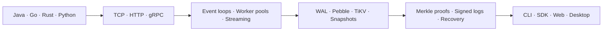

<p align="center">
  <picture>
    <source media="(prefers-color-scheme: dark)" srcset="./assets/header-dark.svg" />
    <source media="(prefers-color-scheme: light)" srcset="./assets/header-light.svg" />
    
  </picture>
</p>

<p align="center">
  <a href="https://github.com/ryan-wong-coder?tab=followers"></a>
  <a href="https://github.com/ryan-wong-coder/trustdb"></a>
  
</p>

```text
$ whoami
Backend and systems engineer turning protocols, storage primitives and concurrency
models into reliable products — from wire format and SDK to desktop interface.
```

## `01 // RECENT WORK STREAM`

<!-- ACTIVITY_FEED:START -->
<table>
  <tr>
    <td width="20%" valign="top">
      <code>JUL 17 · 09:41</code><br />
      <sub>🟣 PR MERGED</sub>
    </td>
    <td valign="top">
      <a href="https://github.com/binaricat/Netcatty/pull/2259"><strong>feat(sync): integrate convergent multi-device sync</strong></a><br />
      <sub><a href="https://github.com/binaricat/Netcatty">binaricat/Netcatty</a> · #2259</sub>
    </td>
  </tr>
  <tr>
    <td width="20%" valign="top">
      <code>JUL 17 · 04:35</code><br />
      <sub>🔵 COMMIT</sub>
    </td>
    <td valign="top">
      <a href="https://github.com/ryan-wong-coder/Netcatty/commit/702f0d5f141fb85592bfc7346d05e52362dda095"><strong>fix(sync): seed legacy downgrade baselines</strong></a><br />
      <sub><a href="https://github.com/ryan-wong-coder/Netcatty">ryan-wong-coder/Netcatty</a> · 702f0d5</sub>
    </td>
  </tr>
  <tr>
    <td width="20%" valign="top">
      <code>JUL 17 · 04:16</code><br />
      <sub>🔵 COMMIT</sub>
    </td>
    <td valign="top">
      <a href="https://github.com/ryan-wong-coder/Netcatty/commit/b951ca88213e8960bd942d73bed38e2f375eab49"><strong>fix(sync): open empty convergent startup gate</strong></a><br />
      <sub><a href="https://github.com/ryan-wong-coder/Netcatty">ryan-wong-coder/Netcatty</a> · b951ca8</sub>
    </td>
  </tr>
  <tr>
    <td width="20%" valign="top">
      <code>JUL 17 · 04:02</code><br />
      <sub>🔵 COMMIT</sub>
    </td>
    <td valign="top">
      <a href="https://github.com/ryan-wong-coder/Netcatty/commit/67e0e066d314169944c71e9dc41922333424994a"><strong>fix(sync): commit merged replicas after apply</strong></a><br />
      <sub><a href="https://github.com/ryan-wong-coder/Netcatty">ryan-wong-coder/Netcatty</a> · 67e0e06</sub>
    </td>
  </tr>
  <tr>
    <td width="20%" valign="top">
      <code>JUL 17 · 03:42</code><br />
      <sub>🔵 COMMIT</sub>
    </td>
    <td valign="top">
      <a href="https://github.com/ryan-wong-coder/Netcatty/commit/30efa8e6a427aa7ab6e4ed7d7ff2f41e27e380a3"><strong>fix(sync): preserve convergent recovery safeguards</strong></a><br />
      <sub><a href="https://github.com/ryan-wong-coder/Netcatty">ryan-wong-coder/Netcatty</a> · 30efa8e</sub>
    </td>
  </tr>
  <tr>
    <td width="20%" valign="top">
      <code>JUL 17 · 03:26</code><br />
      <sub>🔵 COMMIT</sub>
    </td>
    <td valign="top">
      <a href="https://github.com/ryan-wong-coder/Netcatty/commit/25c4f5c5047feff35bc29b087be9a535ce3dddbd"><strong>fix(sync): avoid no-op convergent writes</strong></a><br />
      <sub><a href="https://github.com/ryan-wong-coder/Netcatty">ryan-wong-coder/Netcatty</a> · 25c4f5c</sub>
    </td>
  </tr>
  <tr>
    <td width="20%" valign="top">
      <code>JUL 17 · 01:27</code><br />
      <sub>🟣 PR MERGED</sub>
    </td>
    <td valign="top">
      <a href="https://github.com/ryan-wong-coder/trustdb/pull/202"><strong>ci: update GitHub Actions runtimes</strong></a><br />
      <sub><a href="https://github.com/ryan-wong-coder/trustdb">ryan-wong-coder/trustdb</a> · #202</sub>
    </td>
  </tr>
  <tr>
    <td width="20%" valign="top">
      <code>JUL 17 · 01:20</code><br />
      <sub>🟣 PR MERGED</sub>
    </td>
    <td valign="top">
      <a href="https://github.com/ryan-wong-coder/trustdb/pull/201"><strong>fix: update vulnerable Go dependencies</strong></a><br />
      <sub><a href="https://github.com/ryan-wong-coder/trustdb">ryan-wong-coder/trustdb</a> · #201</sub>
    </td>
  </tr>
  <tr>
    <td width="20%" valign="top">
      <code>JUL 16 · 23:41</code><br />
      <sub>🟣 PR MERGED</sub>
    </td>
    <td valign="top">
      <a href="https://github.com/ryan-wong-coder/trustdb/pull/200"><strong>fix: constrain filesystem access</strong></a><br />
      <sub><a href="https://github.com/ryan-wong-coder/trustdb">ryan-wong-coder/trustdb</a> · #200</sub>
    </td>
  </tr>
  <tr>
    <td width="20%" valign="top">
      <code>JUL 16 · 10:30</code><br />
      <sub>🟠 ISSUE OPENED</sub>
    </td>
    <td valign="top">
      <a href="https://github.com/binaricat/Netcatty/issues/2245"><strong>[Feature] Add convergent multi-device sync with CRDT</strong></a><br />
      <sub><a href="https://github.com/binaricat/Netcatty">binaricat/Netcatty</a> · #2245</sub>
    </td>
  </tr>
</table>

<p align="center"><sub>Public activity · newest first · refreshed every six hours</sub><br />
  <a href="./RECENT_ACTIVITY.md">Open the complete activity log →</a>
</p>
<!-- ACTIVITY_FEED:END -->

## `02 // FIELD NOTES`

<!-- DISCUSSIONS_FEED:START -->
<table>
  <tr>
    <td valign="top">
      <h3><a href="https://github.com/binaricat/Netcatty/discussions/2261">Netcatty 多设备 CRDT 同步：从“为什么会丢数据”到“怎样证明一定收敛”</a></h3>
      <p>本文面向普通开发者，介绍 CRDT 的基本原理，并讲解 Netcatty convergent sync v2 的具体实现。 阅读本文无需分布式系统基础。“半格”“偏序”“向量时钟”等概念，均结合多设备管理 SSH 主机的实际问题说明。文章先解释三件事：传统云同步为何覆盖修改，删除为何可能重新出现，Provider 的处理次序为何会改变结果。 厘清这些问题之后，再引入 CRDT。dot、version vector、MV-Register 和 tombstone 各有明确用途，并非孤立的术语。 后文还会说明这些概念在 Netcatty 代码、云文件协议、迁移流程、恢复机制、冲突界面和测试体系中的对应关系。 阅读方式 全文分为十个篇章，另外附有术语表和阅读检查。 第一篇梳理旧同步的问题；第二篇解释 CRDT 的…</p>
      <sub><a href="https://github.com/binaricat/Netcatty">binaricat/Netcatty</a> · Show and tell · 2026-07-17 · ▲ 1 · 0 comments</sub>
    </td>
  </tr>
</table>

<p align="center"><sub>Long-form Discussions published across public repositories</sub><br />
  <a href="./DISCUSSIONS.md">Browse every article →</a>
</p>
<!-- DISCUSSIONS_FEED:END -->

## `03 // LIVE TELEMETRY`

<picture>
  <source media="(prefers-color-scheme: dark)" srcset="./assets/dashboard-dark.svg" />
  <source media="(prefers-color-scheme: light)" srcset="./assets/dashboard-light.svg" />
  
</picture>

<p align="center"><sub>Generated from the GitHub GraphQL API and refreshed automatically every six hours.</sub></p>

<picture>
  <source media="(prefers-color-scheme: dark)" srcset="https://github-readme-activity-graph.vercel.app/graph?username=ryan-wong-coder&theme=tokyo-night&hide_border=true&radius=10&area=true&custom_title=Contribution%20Signal" />
  <source media="(prefers-color-scheme: light)" srcset="https://github-readme-activity-graph.vercel.app/graph?username=ryan-wong-coder&theme=github-light&hide_border=true&radius=10&area=true&custom_title=Contribution%20Signal" />
  
</picture>

<p align="center">
  <picture>
    <source media="(prefers-color-scheme: dark)" srcset="./assets/contribution-snake-dark.svg" />
    <source media="(prefers-color-scheme: light)" srcset="./assets/contribution-snake.svg" />
    
  </picture>
</p>

## `04 // ENGINEERING TOPOLOGY`



| Layer | What I work on |
| :--- | :--- |
| **Protocols** | TCP message flows, HTTP/gRPC APIs, streaming transports, deterministic CBOR |
| **Concurrency** | Event loops, bounded queues, worker pools, atomic sequencing, graceful shutdown |
| **Data systems** | WAL, append-only logs, Pebble, TiKV, snapshots, backup and restore |
| **Integrity** | SHA-256, Ed25519, Merkle inclusion/consistency proofs, external timestamp anchoring |
| **Product surfaces** | Go SDKs, CLIs, Electron/React, Vue/Wails, Vite and IPC bridges |
| **Operations** | Prometheus, structured logging, CI, integration tests and performance benchmarks |

## `05 // PROOF OF WORK`

<table>
  <tr>
    <td width="50%" valign="top">
      <h3><a href="https://github.com/ryan-wong-coder/trustdb">TrustDB</a></h3>
      <p>A verifiable evidence database that turns file claims into signed receipts, Merkle proofs and independently verifiable transparency-log records.</p>
      <p><code>Go</code> <code>gRPC</code> <code>TiKV</code> <code>Pebble</code> <code>WAL</code> <code>Prometheus</code></p>
    </td>
    <td width="50%" valign="top">
      <h3><a href="https://github.com/ryan-wong-coder/majiang">Mahjong</a></h3>
      <p>A networked Sichuan Mahjong system with multi-room scheduling, an explicit game state machine, reconnectable sessions, automated play and snapshot recovery.</p>
      <p><code>Go</code> <code>TCP</code> <code>JSON Lines</code> <code>Event Loop</code> <code>State Machine</code></p>
    </td>
  </tr>
  <tr>
    <td colspan="2" valign="top">
      <h3><a href="https://github.com/binaricat/Netcatty">Netcatty · upstream contributions</a></h3>
      <p>Runtime integration and event-system work in an Electron desktop application: main-process bridges, streaming event mapping, concurrent state consistency, interactive components, localization and automated tests.</p>
      <p><code>TypeScript</code> <code>React</code> <code>Electron</code> <code>Node.js</code> <code>IPC</code> <code>Event-driven architecture</code></p>
    </td>
  </tr>
</table>

## `06 // WORKBENCH`

<p align="center">
  
  
  
  
</p>

<p align="center">
  
  
  
  
  
  
  
  
  
</p>

---

<p align="center"><code>design the invariant · measure the system · ship the product</code></p>
