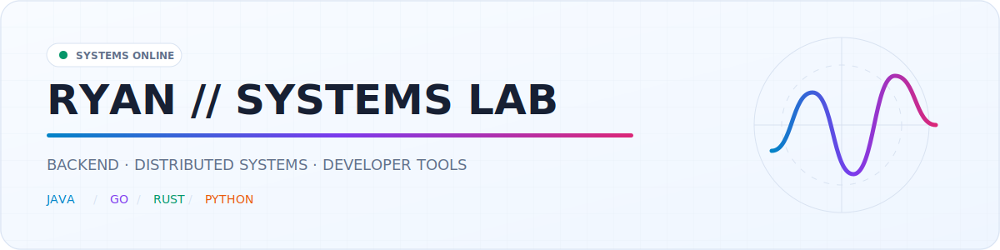
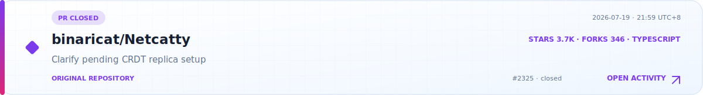
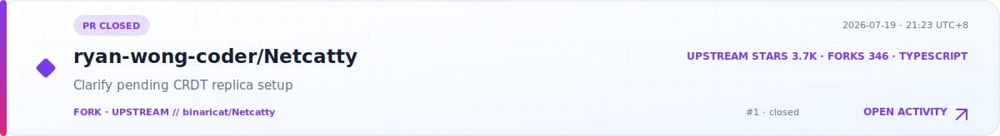
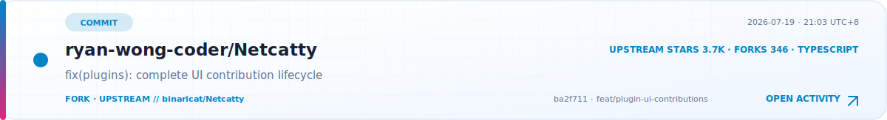
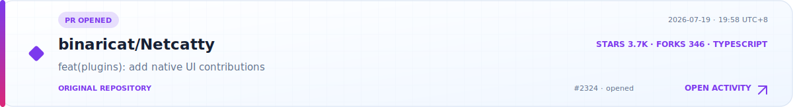
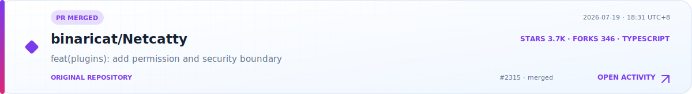
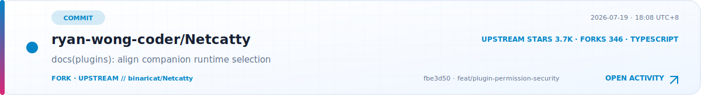
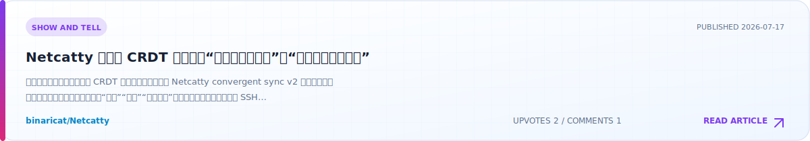
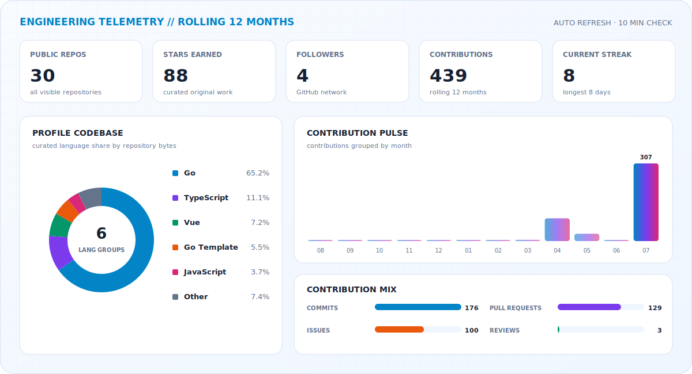
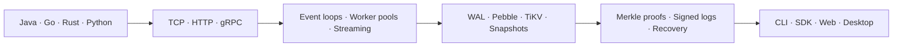

<p align="center">
  <picture>
    <source media="(prefers-color-scheme: dark)" srcset="./assets/header-dark.svg" />
    <source media="(prefers-color-scheme: light)" srcset="./assets/header-light.svg" />
    
  </picture>
</p>

<p align="center">
  <a href="https://github.com/ryan-wong-coder?tab=followers"></a>
  <a href="https://github.com/ryan-wong-coder/trustdb"></a>
  
</p>

```text
$ whoami
Backend and systems engineer turning protocols, storage primitives and concurrency
models into reliable products — from wire format and SDK to desktop interface.
```

## `01 // RECENT WORK STREAM`

<!-- ACTIVITY_FEED:START -->
<a href="https://github.com/binaricat/Netcatty/pull/2325">
  <picture>
    <source media="(prefers-color-scheme: dark)" srcset="./assets/activity-cards/pr-binaricat-netcatty-2325-f40990e2c7-dark.svg" />
    <source media="(prefers-color-scheme: light)" srcset="./assets/activity-cards/pr-binaricat-netcatty-2325-f40990e2c7-light.svg" />
    
  </picture>
</a>
<br />

<a href="https://github.com/ryan-wong-coder/Netcatty/commit/ddc4fa617b691442ee3afec3e1832e6c3c9096c5">
  <picture>
    <source media="(prefers-color-scheme: dark)" srcset="./assets/activity-cards/commit-ryan-wong-coder-netcatty-ddc4fa6-9a4fcf57b1-dark.svg" />
    <source media="(prefers-color-scheme: light)" srcset="./assets/activity-cards/commit-ryan-wong-coder-netcatty-ddc4fa6-9a4fcf57b1-light.svg" />
    
  </picture>
</a>
<br />

<a href="https://github.com/ryan-wong-coder/Netcatty/commit/3c2a3e68b1d8849a7f98d2a8fa6d7c8509c5256a">
  <picture>
    <source media="(prefers-color-scheme: dark)" srcset="./assets/activity-cards/commit-ryan-wong-coder-netcatty-3c2a3e6-f939285953-dark.svg" />
    <source media="(prefers-color-scheme: light)" srcset="./assets/activity-cards/commit-ryan-wong-coder-netcatty-3c2a3e6-f939285953-light.svg" />
    
  </picture>
</a>
<br />

<a href="https://github.com/ryan-wong-coder/Netcatty/pull/1">
  <picture>
    <source media="(prefers-color-scheme: dark)" srcset="./assets/activity-cards/pr-ryan-wong-coder-netcatty-1-2531af49cc-dark.svg" />
    <source media="(prefers-color-scheme: light)" srcset="./assets/activity-cards/pr-ryan-wong-coder-netcatty-1-2531af49cc-light.svg" />
    
  </picture>
</a>
<br />

<a href="https://github.com/ryan-wong-coder/Netcatty/commit/ba2f7111e93d83776aab297dd55f338798e05807">
  <picture>
    <source media="(prefers-color-scheme: dark)" srcset="./assets/activity-cards/commit-ryan-wong-coder-netcatty-ba2f711-3c931102fe-dark.svg" />
    <source media="(prefers-color-scheme: light)" srcset="./assets/activity-cards/commit-ryan-wong-coder-netcatty-ba2f711-3c931102fe-light.svg" />
    
  </picture>
</a>
<br />

<a href="https://github.com/binaricat/Netcatty/pull/2324">
  <picture>
    <source media="(prefers-color-scheme: dark)" srcset="./assets/activity-cards/pr-binaricat-netcatty-2324-1ac9c85624-dark.svg" />
    <source media="(prefers-color-scheme: light)" srcset="./assets/activity-cards/pr-binaricat-netcatty-2324-1ac9c85624-light.svg" />
    
  </picture>
</a>
<br />

<a href="https://github.com/binaricat/Netcatty/pull/2315">
  <picture>
    <source media="(prefers-color-scheme: dark)" srcset="./assets/activity-cards/pr-binaricat-netcatty-2315-cd7d22bdd0-dark.svg" />
    <source media="(prefers-color-scheme: light)" srcset="./assets/activity-cards/pr-binaricat-netcatty-2315-cd7d22bdd0-light.svg" />
    
  </picture>
</a>
<br />

<a href="https://github.com/ryan-wong-coder/Netcatty/commit/fbe3d50e3943f8719a5eaa5e2a8165c1b690d306">
  <picture>
    <source media="(prefers-color-scheme: dark)" srcset="./assets/activity-cards/commit-ryan-wong-coder-netcatty-fbe3d50-143c177277-dark.svg" />
    <source media="(prefers-color-scheme: light)" srcset="./assets/activity-cards/commit-ryan-wong-coder-netcatty-fbe3d50-143c177277-light.svg" />
    
  </picture>
</a>
<br />


<p align="center"><sub>Public activity · newest first · refreshed every six hours</sub><br />
  <a href="./RECENT_ACTIVITY.md">Open the complete activity log →</a>
</p>
<!-- ACTIVITY_FEED:END -->

## `02 // FIELD NOTES`

<!-- DISCUSSIONS_FEED:START -->
<a href="https://github.com/binaricat/Netcatty/discussions/2261">
  <picture>
    <source media="(prefers-color-scheme: dark)" srcset="./assets/discussion-cards/discussion-binaricat-netcatty-2261-334203b2e3-dark.svg" />
    <source media="(prefers-color-scheme: light)" srcset="./assets/discussion-cards/discussion-binaricat-netcatty-2261-334203b2e3-light.svg" />
    
  </picture>
</a>
<br />


<p align="center"><sub>Long-form Discussions published across public repositories</sub><br />
  <a href="./DISCUSSIONS.md">Browse every article →</a>
</p>
<!-- DISCUSSIONS_FEED:END -->

## `03 // LIVE TELEMETRY`

<picture>
  <source media="(prefers-color-scheme: dark)" srcset="./assets/dashboard-dark.svg" />
  <source media="(prefers-color-scheme: light)" srcset="./assets/dashboard-light.svg" />
  
</picture>

<p align="center"><sub>Generated from the GitHub GraphQL API and refreshed automatically every six hours.</sub></p>

<picture>
  <source media="(prefers-color-scheme: dark)" srcset="https://github-readme-activity-graph.vercel.app/graph?username=ryan-wong-coder&theme=tokyo-night&hide_border=true&radius=10&area=true&custom_title=Contribution%20Signal" />
  <source media="(prefers-color-scheme: light)" srcset="https://github-readme-activity-graph.vercel.app/graph?username=ryan-wong-coder&theme=github-light&hide_border=true&radius=10&area=true&custom_title=Contribution%20Signal" />
  
</picture>

<p align="center">
  <picture>
    <source media="(prefers-color-scheme: dark)" srcset="./assets/contribution-snake-dark.svg" />
    <source media="(prefers-color-scheme: light)" srcset="./assets/contribution-snake.svg" />
    
  </picture>
</p>

## `04 // ENGINEERING TOPOLOGY`



| Layer | What I work on |
| :--- | :--- |
| **Protocols** | TCP message flows, HTTP/gRPC APIs, streaming transports, deterministic CBOR |
| **Concurrency** | Event loops, bounded queues, worker pools, atomic sequencing, graceful shutdown |
| **Data systems** | WAL, append-only logs, Pebble, TiKV, snapshots, backup and restore |
| **Integrity** | SHA-256, Ed25519, Merkle inclusion/consistency proofs, external timestamp anchoring |
| **Product surfaces** | Go SDKs, CLIs, Electron/React, Vue/Wails, Vite and IPC bridges |
| **Operations** | Prometheus, structured logging, CI, integration tests and performance benchmarks |

## `05 // PROOF OF WORK`

<table>
  <tr>
    <td width="50%" valign="top">
      <h3><a href="https://github.com/ryan-wong-coder/trustdb">TrustDB</a></h3>
      <p>A verifiable evidence database that turns file claims into signed receipts, Merkle proofs and independently verifiable transparency-log records.</p>
      <p><code>Go</code> <code>gRPC</code> <code>TiKV</code> <code>Pebble</code> <code>WAL</code> <code>Prometheus</code></p>
    </td>
    <td width="50%" valign="top">
      <h3><a href="https://github.com/ryan-wong-coder/majiang">Mahjong</a></h3>
      <p>A networked Sichuan Mahjong system with multi-room scheduling, an explicit game state machine, reconnectable sessions, automated play and snapshot recovery.</p>
      <p><code>Go</code> <code>TCP</code> <code>JSON Lines</code> <code>Event Loop</code> <code>State Machine</code></p>
    </td>
  </tr>
  <tr>
    <td colspan="2" valign="top">
      <h3><a href="https://github.com/binaricat/Netcatty">Netcatty · upstream contributions</a></h3>
      <p>Runtime integration and event-system work in an Electron desktop application: main-process bridges, streaming event mapping, concurrent state consistency, interactive components, localization and automated tests.</p>
      <p><code>TypeScript</code> <code>React</code> <code>Electron</code> <code>Node.js</code> <code>IPC</code> <code>Event-driven architecture</code></p>
    </td>
  </tr>
</table>

## `06 // WORKBENCH`

<p align="center">
  
  
  
  
</p>

<p align="center">
  
  
  
  
  
  
  
  
  
</p>

---

<p align="center"><code>design the invariant · measure the system · ship the product</code></p>
